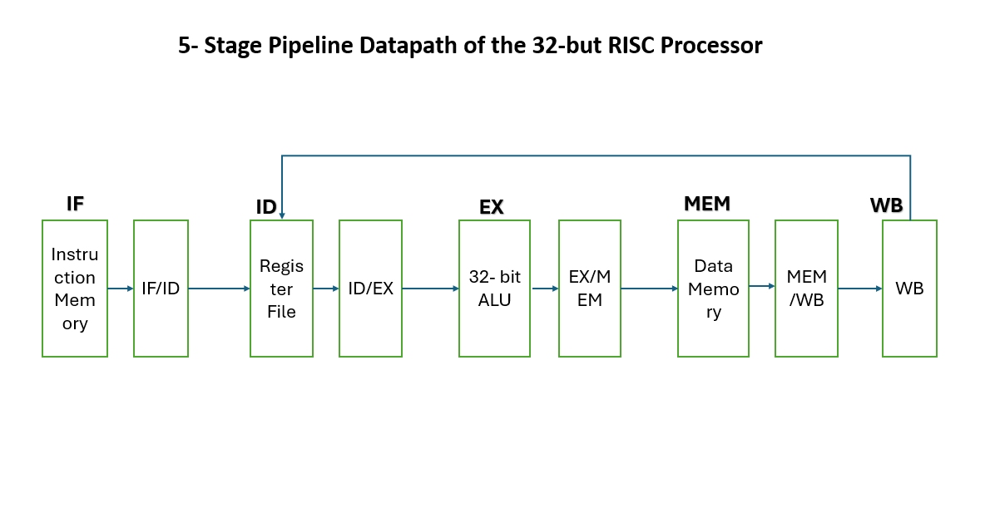

# Design & Optimization of a 32-bit Pipelined RISC Processor

## Overview

This project focuses on the *RTL design, optimization, and verification of a **32-bit Arithmetic Logic Unit (ALU)** and its integration into a **5-stage pipelined RISC processor**.  
The design emphasizes *performance optimization, modular architecture, and pipeline correctness*, making it suitable for graduate-level computer architecture coursework and research-oriented study.

The processor is implemented in *Verilog HDL* and follows a classical RISC pipeline structure with additional support for *data hazard detection and forwarding*.

## Processor Architecture

The processor follows a **classical 5-stage RISC pipeline** consisting of:

1. *Instruction Fetch (IF)* – Fetches the instruction from instruction memory  
2. *Instruction Decode (ID)* – Decodes the instruction and reads register operands  
3. *Execute (EX)* – Performs arithmetic and logical operations using the ALU  
4. *Memory Access (MEM)* – Accesses data memory for load/store instructions  
5. *Write Back (WB)* – Writes the result back to the register file  

Pipeline registers separate each stage to enable *instruction-level parallelism* and improve overall throughput.

## Architecture Diagrams

### Overall Processor Architecture

### 5-Stage Pipeline Datapath

### Hazard Detection and Data Forwarding

## Pipeline Hazards and Data Forwarding

The pipelined processor accounts for *data hazards* that arise due to instruction dependencies across pipeline stages.  
A dedicated *hazard detection unit* monitors source and destination registers and introduces pipeline stalls when required to ensure correct execution.

To minimize performance degradation caused by stalls, a *data forwarding (bypassing) unit* is implemented.  
This unit forwards results from later pipeline stages (EX/MEM and MEM/WB) directly to the Execute stage, reducing unnecessary pipeline stalls and improving instruction throughput.

The combined use of hazard detection and forwarding enables the processor to maintain functional correctness while achieving higher performance through effective instruction-level parallelism.

## ALU Design and Adder Architecture Comparison

The 32-bit ALU is designed as a *modular and parameterized unit*, supporting arithmetic, logical, comparison, and shift operations.  
To study performance trade-offs, multiple adder architectures were implemented and evaluated:

- *Ripple Carry Adder (RCA)* – Simple and area-efficient, but with higher propagation delay  
- *Carry Look-Ahead Adder (CLA)* – Reduces carry propagation delay using parallel carry computation  
- *Hierarchical 32-bit CLA* – Built using 4-bit true CLA blocks to balance speed and complexity  

Comparative analysis of these adders highlights the impact of carry propagation on critical path delay and overall processor performance.  
The final ALU configuration was selected based on a balance between *speed, hardware complexity, and scalability*.
This analysis informed the final ALU integration used in the pipelined processor, ensuring that arithmetic performance does not become the critical bottleneck in the execution stage.

## Verification and Waveform-Based Validation

The processor was verified using cycle-accurate waveform analysis in ModelSim, with a focus on validating pipeline register behavior and data propagation across stages.

Verification was performed stage-by-stage:

- IF/ID Stage:  
  Verified correct instruction fetch, program counter update, and instruction latching into the IF/ID pipeline register.

- ID/EX Stage:  
  Confirmed correct decoding of source/destination registers, immediate generation, and control signal propagation (ALUSrc, RegWrite).

- EX/MEM Stage:  
  Validated ALU operation selection, operand forwarding, and correct transfer of ALU results into the EX/MEM register.

- MEM/WB Stage:  
  Verified correct write-back register selection, MemToReg control behavior, and final write-back data consistency.

## Testbench Design and Functional Verification Strategy

Functional verification of the design was performed using **custom Verilog testbenches** developed for both the ALU and the pipelined processor.  
The ALU testbench validates arithmetic, logical, comparision and shift operations across a wide range of input combinations, ensuring correctness for all supported instruction types.

The pipeline testbench verifies correct instruction flow across all five stages, with particular emphasis on:
- Register operand propogation
- Control signal timing
- Data hazard scenarios
- Forwarding and write-back correctness
Simulation results, confirm correct functionality, proper pipeline control, and stable operation under dependent instruction sequences.

## Learning Outcomes

This project strengthened my understanding of:
- RTL-based hardware design using Verilog HDL  
- Arithmetic unit design and adder architecture trade-offs  
- Pipelined processor microarchitecture  
- Pipeline hazards, stalling, and data forwarding mechanisms  
- Verification-driven hardware development  

The project provided practical exposure to translating architectural concepts into synthesizable RTL implementations.

## Future Work

Possible extensions of this work include:
- Control hazard handling and branch prediction  
- Clock gating and low-power optimization  
- Cache integration and memory hierarchy exploration  
- ASIC synthesis and physical design flow

This project demonstrates a complete RTL-to-verification workflow for a pipelined processor, bridging architectural concepts with practical hardware implementation.
